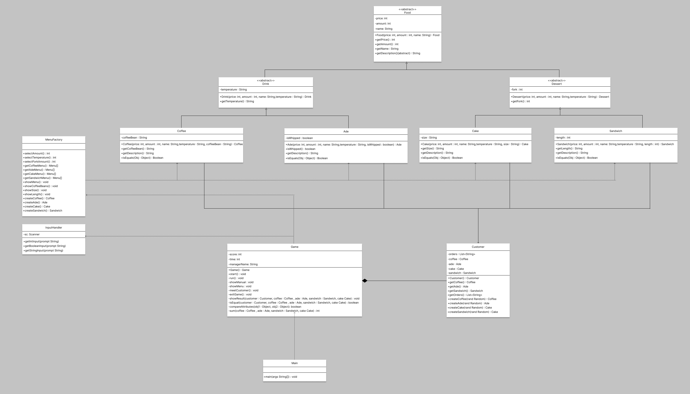

# 1. 주제. KaTeBu 카페의 일일 매니저 체험

- 프로그램 설명
    
    ## 1. 사용자 이름 입력
    
    ```
    안녕하세요! 오늘부터 당신이 맡게 될 KaTeBu 카페입니다~
    당신의 이름을 알려주세요!
    ```
    
    ## 2. 규칙 설명
    
    ```
    <사용자 이름> 매니저님! 환영합니다~! 지금부터 간단한 규칙 알려드리겠습니다
    1. KaTeBu 카페 영업 시간은 9시부터 18시까지입니다.
    2. KaTeBu 카페는 프리미엄 카페라 1시간에 한 번 예약된 손님을 받습니다.
    3. 손님의 요구 사항에 맞춰 메뉴를 제공해 주세요.
    4. 잘못된 메뉴를 제공하면 손실액만큼 이익이 차감됩니다.
      4-1. 저희 손님들은 자부심이 높기 때문에 서비스를 준다면, 자신을 무시했다고 생각해, 돈을 내지 않습니다.
    5. 영업 종료 후 순이익이 마이너스면 해고되니 주의해주세요!
    6. 다음은 각 메뉴의 체크리스트입니다.
      6-1. 디저트는 포크의 개수를 요구사항에 맞게 정확히 드려야합니다
      6-2. 샌드위치는 길이, 그리고 케이크는 사이즈를 요구사항에 맞게 정확히 드려야합니다.
      6-3. 모든 음료는 HOT, ICE를 선택할 수 있으나, 에이드는 무조건 "ICE" 밖에 제공안되는 점 명시해주세요
      6-4. 커피는 원두 종류를 선택할 수 있습니다! 고객의 요구사항에 맞는 원두를 선택해주세요
      6-5. 에이드는 휘핑크림 여부를 선택할 수 있습니다!
    7. 그럼 화이팅해주세요!
    ```
    
    ## 3. 행동 선택
    
    ```
    --------------------------------------------------------------
    현재 시간: <현시간>     현재 이익: <이익>원     매니저: <사용자 이름>
    1. 손님 맞이하기
    2. 메뉴판 보기
    3. 규칙 보기
    4. 영업 종료하기
    --------------------------------------------------------------
    행동을 입력해주세요.
    ```
    
    ### 3-1. 손님 맞이하기 (손님의 주문은 랜덤 생성)
    
    ```
    --------------------------------------------------------------
    안녕하세요! 먼저 커피는 카페라테 로 주시고, HOT로 해주세요. 아 원두는 아라비아타로 해주시고 2잔 주세요. 
    그리고 자몽에이드 5잔 주세요. 휘핑크림은 빼고요! 
    그리고 케이크는 딸기 케이크로 사이즈는 medium로 포크는 3개 주시고요. 2개 주세요! 
    --------------------------------------------------------------
    손님이 원하는 메뉴를 골라주세요!
    ```
    
    ### 커피 선택지
    
    ```
    손님이 원하는 커피는 무엇인가요? (주문하지 않음을 선택하면 밑의 선택지 스킵)
    1. 아메리카노
    2. 카페라테
    3.주문하지 않음.
    --------------------------
    <선택지 입력>
    --------------------------
    ICE 인가요? HOT 인가요?
    1. ICE
    2. HOT
    --------------------------
    <선택지 입력>
    --------------------------
    원두 종류는 무엇인가요?
    1. 아라비아타
    2. 로부스타
    --------------------------
    <선택지 입력>
    --------------------------
    마지막으로 몇 잔 시키셨나요?
    --------------------------
    <선택지 입력>
    --------------------------
    ```
    
    ### 에이드 선택지
    
    ```
    손님이 원하는 에이드는 무엇인가요? (주문하지 않음을 선택하면 밑의 선택지 스킵)
    1. 레몬에이드
    2. 자몽에이드
    3. 주문하지 않음
    --------------------------
    <선택지 입력>
    --------------------------
    ICE 인가요? HOT 인가요?
    1. ICE
    2. HOT
    --------------------------
    <선택지 입력>
    --------------------------
    휘핑크림을 추가할까요? (1: 예, 2: 아니오)
    --------------------------
    <선택지 입력>
    --------------------------
    마지막으로 몇 잔 시키셨나요?
    --------------------------
    <선택지 입력>
    --------------------------
    ```
    
    ### 케이크 선택지
    
    ```
    손님이 원하는 케이크는 무엇인가요?(주문하지 않음을 선택하면 밑의 선택지 스킵)
    1. 딸기 케이크
    2. 초콜릿 케이크
    3. 주문하지 않음
    --------------------------
    <선택지 입력>
    --------------------------
    사이즈를 선택해주세요
    1. small
    2. medium
    3. large
    --------------------------
    <선택지 입력>
    --------------------------
    포크 개수를 입력해주세요.
    --------------------------
    <선택지 입력>
    --------------------------
    마지막으로 몇 개 시키셨나요?
    --------------------------
    <선택지 입력>
    --------------------------
    
    ```
    
    ### 샌드위치 선택지
    
    ```
    손님이 원하는 샌드위치는 무엇인가요? (주문하지 않음을 선택하면 밑의 선택지 스킵)
    1. 치킨 샌드위치
    2. 계란 샌드위치
    3. 주문하지 않음
    --------------------------
    <선택지 입력>
    --------------------------
    샌드위치 길이를 선택해주세요
    1. 15cm
    2. 30cm
    --------------------------
    <선택지 입력>
    --------------------------
    포크 개수를 입력해주세요.
    --------------------------
    <선택지 입력>
    --------------------------
    마지막으로 몇 개 시키셨나요?
    --------------------------
    <선택지 입력>
    --------------------------
    
    ```
    
    ### 결과
    
    ```
    #실패시
    --------------------------------------------------------------
    손님이 주문하신 것
    커피 : 아메리카노
       - 온도 : HOT
       - 커피 원두 : 로부스타
       - 수량 : 3잔
    에이드 : 자몽에이드
       - 휘핑크림 여부 : 포함
       - 수량 : 5잔
    샌드위치 : 계란 샌드위치
       - 길이 : 15Cm
       - 포크 개수 : 2개
       - 수량 : 5개
    --------------------------------------------------------------
    매니저님이 선택하신 것
    커피 : 아메리카노
       - 온도 : ICE
       - 커피 원두 : 아라비아타
       - 수량 : 1잔
    에이드 : 레몬에이드
       - 휘핑크림 여부 : 포함
       - 수량 : 1잔
    케이크 : 딸기 케이크
       - 사이즈 : small
       - 포크 개수 : 1개
       - 수량 : 1개
    케이크 : 치킨 샌드위치
       - 길이 : 15Cm
       - 포크 개수 : 1개
       - 수량 : 1개
    --------------------------------------------------------------
    결과 : 실패..
    손님 : 제가 주문한게 아닌데요? 환불해주세요!
    --------------------------------------------------------------
    
    #성공시
    --------------------------------------------------------------
    손님이 주문하신 것
    커피 : 아메리카노
       - 온도 : HOT
       - 커피 원두 : 로부스타
       - 수량 : 3잔
    에이드 : 자몽에이드
       - 휘핑크림 여부 : 포함
       - 수량 : 5잔
    샌드위치 : 계란 샌드위치
       - 길이 : 15Cm
       - 포크 개수 : 2개
       - 수량 : 5개
    --------------------------------------------------------------
    매니저님이 선택하신 것
    커피 : 아메리카노
       - 온도 : HOT
       - 커피 원두 : 로부스타
       - 수량 : 3잔
    에이드 : 자몽에이드
       - 휘핑크림 여부 : 포함
       - 수량 : 5잔
    케이크 : 계란 샌드위치
       - 길이 : 15Cm
       - 포크 개수 : 2개
       - 수량 : 5개
    --------------------------------------------------------------
    결과 : 성공!
    손님 : 감사합니다! 좋은 하루되세요~
    --------------------------------------------------------------
    ```
    
    ### 3-2. 메뉴판 보기
    
    ```
    메뉴판:
    1. 샌드위치 - 치킨 샌드위치, 계란 샌드위치 - 5,000 원 
    2. 케이크 - 생크림 케이크, 초콜릿 케이크 - 7,000 원
    3. 커피 - 아메리카노, 에스프레소 - 3,000 원
    4. 에이드 - 레몬에이드, 자몽에이드 - 4,000 원
    ```
    
    ### 3-3. 규칙 보기
    
    ```
    1. KaTeBu 카페 영업 시간은 9시부터 18시까지입니다.
    2. KaTeBu 카페는 프리미엄 카페라 1시간에 한 번 예약된 손님을 받습니다.
    3. 손님의 요구 사항에 맞춰 메뉴를 제공해 주세요.
    4. 잘못된 메뉴를 제공하면 손실액만큼 이익이 차감됩니다.
      4-1. 저희 손님들은 자부심이 높기 때문에 서비스를 준다면, 자신을 무시했다고 생각해, 돈을 내지 않습니다.
    5. 영업 종료 후 순이익이 마이너스면 해고되니 주의해주세요!
    6. 다음은 각 메뉴의 체크리스트입니다.
      6-1. 디저트는 포크의 개수를 요구사항에 맞게 정확히 드려야합니다
      6-2. 샌드위치는 길이, 그리고 케이크는 사이즈를 요구사항에 맞게 정확히 드려야합니다.
      6-3. 모든 음료는 HOT, ICE를 선택할 수 있으나, 에이드는 무조건 "ICE" 밖에 제공안되는 점 명시해주세요
      6-4. 커피는 원두 종류를 선택할 수 있습니다! 고객의 요구사항에 맞는 원두를 선택해주세요
      6-5. 에이드는 휘핑크림 여부를 선택할 수 있습니다!
    7. 그럼 화이팅해주세요!
    ```
    
    ### 3-4. 영업 종료하기
    
    ```
    
    #실패시
    
    영업을 종료합니다. 최종 이익: <이익 < 0> 원
    해고되었습니다...
    
    #성공시
    
    영업을 종료합니다. 최종 이익: <이익 > 0>원
    오늘 하루도 수고하셨습니다!
    ```
    

# 2. 클래스 다이어그램

# 3. 과제를 하면서 고려한 것

---

- 2차 상속을 구현하면서, 클래스들의 공통점을 모아서 관리하려 하는 목적이면 추상 클래스가 더 낫다고 생각해 조부모 클래스인 Food 와 부모 클래스들인 Dessert, Drink 클래스를 추상 클래스로 선언했다.
- Scanner 객체를 각 클래스에서 사용하게 되어서, 이 입력을 InputHandler를 통해 분리

---

.png)

# 3. 과제를 하면서 고려한 것

---

- 2차 상속을 구현하면서, 클래스들의 공통점을 모아서 관리하려 하는 목적이면 추상 클래스가 더 낫다고 생각해 조부모 클래스인 Food 와 부모 클래스들인 Dessert, Drink 클래스를 추상 클래스로 선언했다.
- Scanner 객체를 각 클래스에서 사용하게 되어서, 이 입력을 InputHandler를 통해 분리